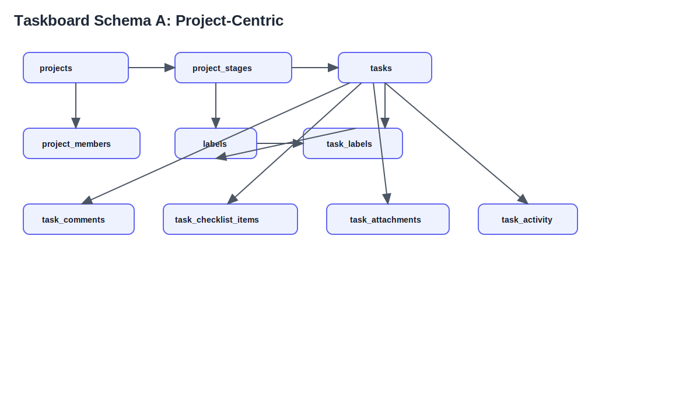
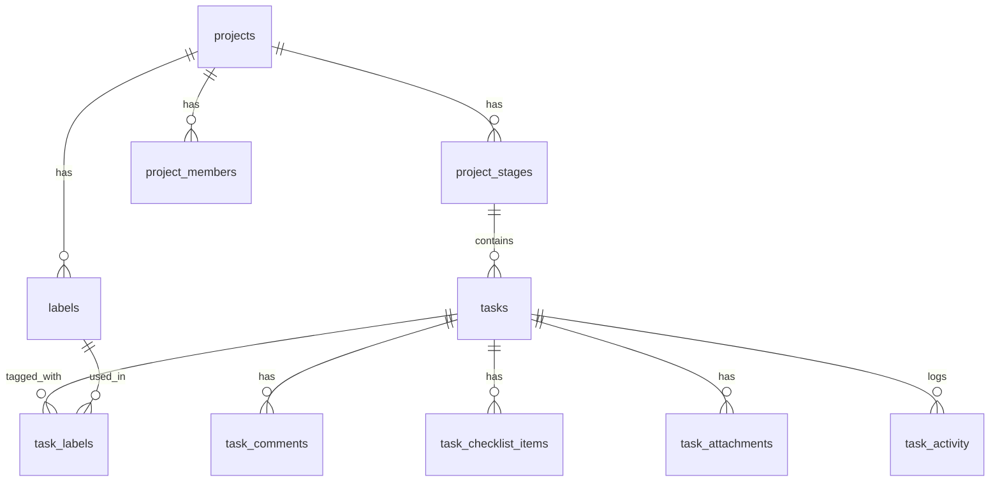
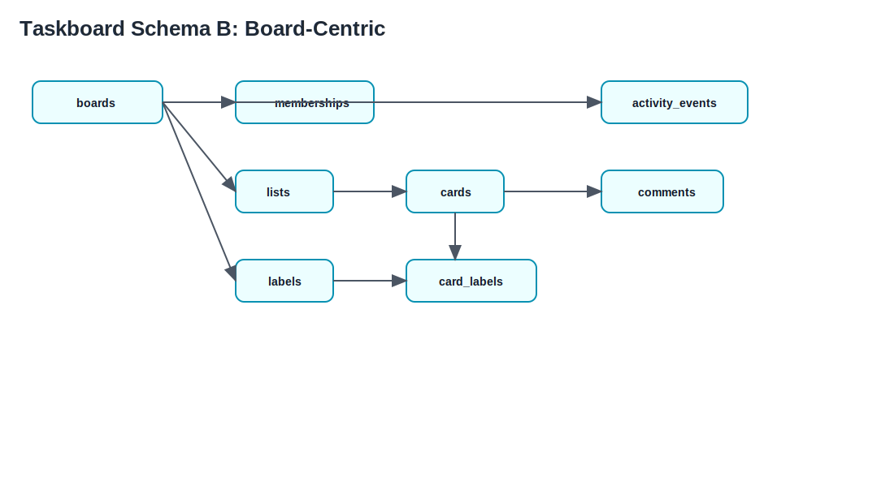
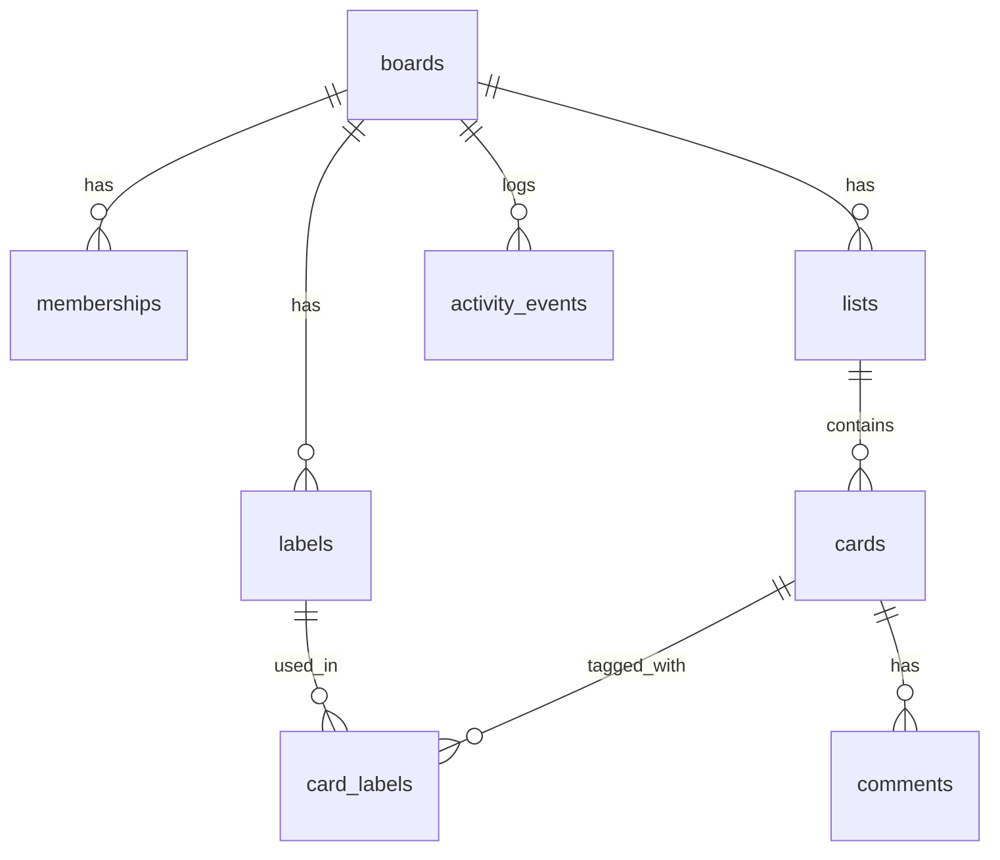

# Taskboard

Taskboard is a Trello-style task management app built with Vanilla JavaScript and Supabase.  
It provides project boards, task stages, labels, comments, deadlines, activity tracking, and project member management.

## Tech Stack

- Frontend: Vite, Vanilla JS (ES modules), Bootstrap 5, HTML/CSS
- Backend: Supabase (Postgres, Auth, RLS)
- Tooling: Supabase CLI, Node.js scripts

## Features

- Authentication with Supabase Auth (email/password)
- Project dashboard and project detail pages
- Kanban-like task workflow with stages (Not Started, In Progress, Done)
- Task metadata: labels, checklists, comments, attachments, deadlines, activity log
- Project members and admin panel support
- Row-Level Security policies for data access control

## Project Structure

```text
src/
  components/      # Shared UI components (header, footer)
  pages/           # Route-driven pages
  services/        # Supabase service layer
  styles/          # Global CSS
  utils/           # Shared utility helpers
supabase/
  migrations/      # SQL migrations
  schema.sql       # Baseline schema snapshot
scripts/
  seed.mjs         # Seed script for sample users/projects/tasks
```

## Prerequisites

- Node.js 18+
- npm 9+
- Supabase project (or local Supabase via Docker)

## Quick Start

1. Install dependencies:

   ```bash
   npm install
   ```

2. Create `.env` in the project root:

   ```env
   VITE_SUPABASE_URL=https://your-project.supabase.co
   VITE_SUPABASE_ANON_KEY=your-anon-key
   # Optional for creating users in seed script:
   # SUPABASE_SERVICE_ROLE_KEY=your-service-role-key
   ```

3. Start the dev server:

   ```bash
   npm run dev
   ```

## NPM Scripts

- `npm run dev` - Start Vite development server
- `npm run build` - Build production bundle
- `npm run preview` - Preview production build locally
- `npm run seed` - Seed sample users/projects/tasks
- `npm run db:start` - Start local Supabase stack
- `npm run db:stop` - Stop local Supabase stack
- `npm run db:reset` - Reset local DB and apply migrations
- `npm run db:push` - Push local migrations to linked remote project
- `npm run db:pull` - Pull remote schema changes to local
- `npm run db:sync` - Push, start, reset, and seed in one flow

## Database & Supabase

- SQL migrations are in `supabase/migrations/`
- If using Supabase Cloud, link your project and run:

  ```bash
  npx supabase link --project-ref <your-project-ref>
  npm run db:push
  ```

- For local development with Docker:

  ```bash
  npm run db:start
  npm run db:reset
  npm run seed
  ```

## Database Schemas

Taskboard currently contains two schema tracks in the repository:

- **Project-centric schema (active in app services):** `projects`, `project_stages`, `tasks`, `project_members`, `labels`, `task_labels`, `task_comments`, `task_checklist_items`, `task_attachments`, `task_activity`.
- **Board-centric schema (available in `supabase/schema.sql`):** `boards`, `memberships`, `lists`, `cards`, `labels`, `card_labels`, `comments`, `activity_events`.

### Schema A: Project-Centric (Tasks Workflow)

Static diagram files:

- `docs/schema-project-centric.svg`
- `docs/schema-project-centric.png`





Core relationships:

- `project_stages.project_id -> projects.id`
- `tasks.stage_id -> project_stages.id`
- `project_members.project_id -> projects.id`
- `labels.project_id -> projects.id`
- `task_labels.task_id -> tasks.id`, `task_labels.label_id -> labels.id`
- `task_comments.task_id -> tasks.id`
- `task_checklist_items.task_id -> tasks.id`
- `task_attachments.task_id -> tasks.id`
- `task_activity.task_id -> tasks.id`

### Schema B: Board-Centric (Legacy/Alternative Model)

Static diagram files:

- `docs/schema-board-centric.svg`
- `docs/schema-board-centric.png`





Core relationships:

- `memberships.board_id -> boards.id`
- `lists.board_id -> boards.id`
- `cards.list_id -> lists.id`
- `labels.board_id -> boards.id`
- `card_labels.card_id -> cards.id`, `card_labels.label_id -> labels.id`
- `comments.card_id -> cards.id`
- `activity_events.board_id -> boards.id`

### RLS Coverage

- Both schema tracks rely on Supabase Row-Level Security.
- Access is scoped to resource ownership/member access (project owner/member or board owner/member).
- Keep policy updates in migrations to avoid schema drift between environments.

## Sample Seed Accounts

When seeding with service role access, the script creates:

- `steve@gmail.com` / `pass123`
- `maria@gmail.com` / `pass123`
- `peter@gmail.com` / `pass123`

## Main Routes

- `/` - Home
- `/login` - Login
- `/dashboard` - Dashboard
- `/projects` - Project list
- `/projects/:id/tasks` - Project tasks
- `/projects/:id/users` - Project members
- `/projects/:id/labels` - Labels
- `/projects/:id/deadlines` - Deadlines
- `/projects/:id/activity` - Activity feed
- `/admin` - Admin page

## Notes

- App expects Supabase environment variables at runtime.
- RLS policies enforce ownership/membership access on project data.
- If port `5173` is busy, run Vite on another port:

  ```bash
  npm run dev -- --port 5174
  ```

  ## Deploy to Netlify

  This repository includes `netlify.toml` configured for Vite SPA deploys:

  - Build command: `npm run build`
  - Publish directory: `dist`
  - SPA fallback redirect: `/* -> /index.html (200)`

  ### Netlify UI (recommended)

  1. In Netlify, click **Add new site** → **Import an existing project**.
  2. Connect GitHub and select this repository.
  3. Keep defaults from `netlify.toml`.
  4. Add environment variables:
    - `VITE_SUPABASE_URL`
    - `VITE_SUPABASE_ANON_KEY`
  5. Deploy.

  ### Netlify CLI (optional)

  ```bash
  npx netlify login
  npx netlify deploy --create-site <site-name> --dir dist --prod
  ```